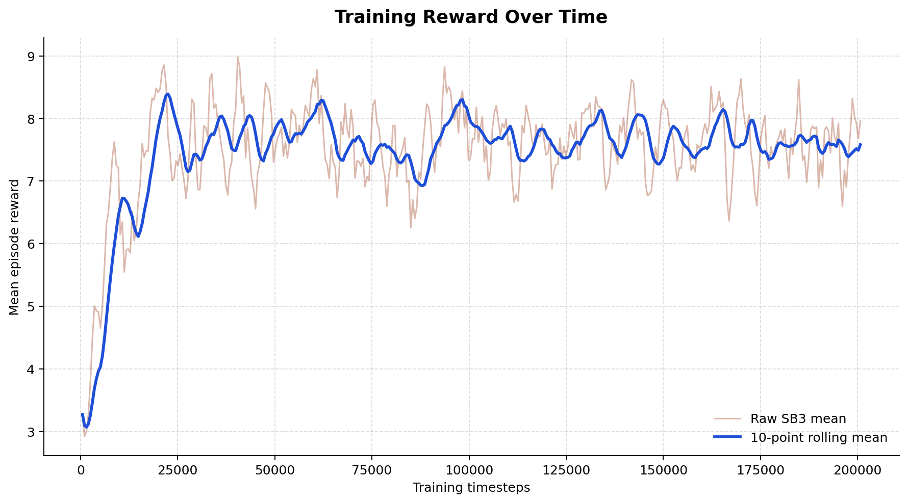
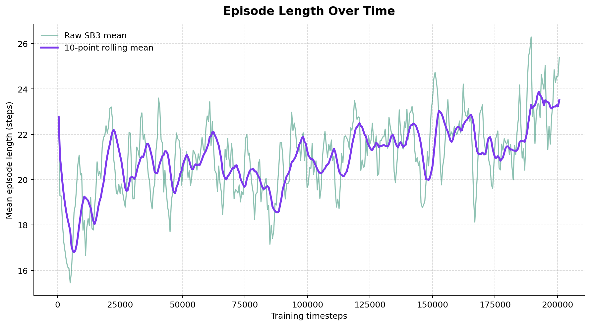
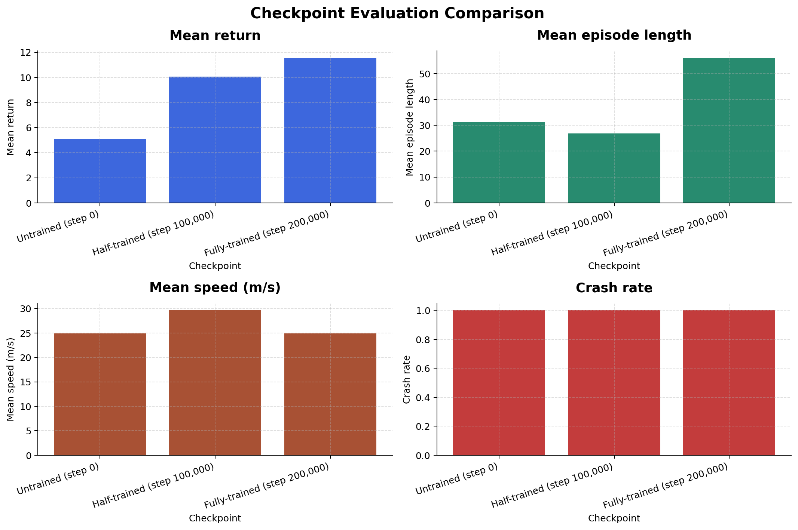

<div align="center">

# 🚗 Autonomous Driving with Reinforcement Learning
<p align="center">


</p>

### CMP4501 – Applied Reinforcement Learning

#### Option A – Autonomous Driving using Highway-Env

---

### 👨‍💻 Authors

**Kerim Elmalı – 2282509**  
**Mohammad Siyam – 2267953**  
**Abdalla Hamuda – 2105020**

Department of Software Engineering  
Bahçeşehir University (BAU)

---

### 🎬 Agent Evolution


*Progression from an untrained policy to the final PPO agent*

</div>

---

## 📋 Table of Contents

1. [Project Overview 🌟](#project-overview-)
2. [Objectives 🎯](#objectives-)
3. [Environment, States and Actions 🌎](#environment-states-and-actions-)
4. [Reward Function 🎯](#reward-function-)
5. [PPO Methodology 🧠](#ppo-methodology-)
6. [Training Pipeline ⚙️](#training-pipeline-)
7. [Training Analysis 📈](#training-analysis-)
8. [Evaluation Results 🏁](#evaluation-results-)
9. [Recorded Media 🎥](#recorded-media-)
10. [Challenges and Solutions ⚠️](#challenges-and-solutions-)
11. [Limitations 🚧](#limitations-)
12. [Repository Structure 📁](#repository-structure-)
13. [Installation and Use 🛠️](#installation-and-use-)
14. [Reproducibility 🔄](#reproducibility-)
15. [Future Work 🔬](#future-work-)
16. [References 📚](#references-)
17. [Key Results Summary 📊](#key-results-summary-)
18. [Conclusion ✅](#conclusion-)

---

## Project Overview 🌟

This project implements a Proximal Policy Optimization (PPO) agent for the
`highway-v0` environment. The agent receives a flattened kinematics
observation and chooses one of five discrete driving actions. A custom
five-component reward replaces the native environment reward during training
and evaluation.

The repository contains the source code, training CSV and TensorBoard log,
three model checkpoints, evaluation results, plots, and representative videos
for run `ppo_highway_20260605_110802`.

### Evidence Used in This Report

| Claim type | Repository evidence |
|---|---|
| Environment, PPO, and reward configuration | `src/config.py`, `src/reward.py`, `src/train.py` |
| Observation and action processing | `src/utils.py`, `src/test_env.py` |
| Training metrics and timing | `logs/ppo_highway_20260605_110802/progress.csv`, `logs/train.log` |
| Evaluation metrics | `results/comparison_ppo_highway_20260605_110802.json` |
| Model structure and parameter count | Saved checkpoints loaded with SB3 |
| Artifact names and sizes | Files in `assets/`, `checkpoints/`, `results/`, and `videos/` |

No result in this README is estimated. Design discussion and future-work
suggestions are labeled separately from measured results.

---

## Objectives 🎯

- Configure `highway-v0` for a four-lane, 20-vehicle driving task.
- Train a PPO policy with a custom shaped reward.
- Save untrained, midpoint, and final checkpoints.
- Record CSV and TensorBoard training metrics.
- Compare the three checkpoints through deterministic evaluation.
- Produce training plots and an evolution animation.

---

## Environment, States and Actions 🌎

### Environment Configuration

The following values are defined by `EnvConfig` in `src/config.py`.

| Parameter | Verified value |
|---|---:|
| Environment ID | `highway-v0` |
| Lanes | 4 |
| Vehicles | 20 total vehicles |
| Episode duration | 40 s |
| Policy frequency | 2 Hz |
| Simulation frequency | 15 Hz |
| Maximum configured decision steps | 80 |
| Reward speed range | 20-30 m/s |

The maximum decision-step count follows directly from the configured
40-second duration and 2 Hz policy frequency.

### Observation Space

The environment uses a normalized, ego-relative `Kinematics` observation for
five vehicles: the ego vehicle and four nearby vehicles. Each vehicle has five
features:

$$
\left[\text{presence}, x, y, v_x, v_y\right].
$$

The raw matrix has shape

$$
\mathbf{O}_t \in \mathbb{R}^{5 \times 5}.
$$

`FlattenObservation` converts it to a 25-value vector:

$$
\mathbf{o}_t \in \mathbb{R}^{25}.
$$

The configured feature ranges before normalization are:

| Feature | Configured range |
|---|---:|
| `x` | [-100, 100] |
| `y` | [-100, 100] |
| `vx` | [-20, 20] |
| `vy` | [-20, 20] |

### Action Space

`DiscreteMetaAction` provides five actions:

| Index | Action |
|---:|---|
| 0 | `LANE_LEFT` |
| 1 | `IDLE` |
| 2 | `LANE_RIGHT` |
| 3 | `FASTER` |
| 4 | `SLOWER` |

---

##  Reward Function 🎯

The wrapper in `src/reward.py` replaces the native reward with:

$$
R(t) =
w_{\mathrm{spd}}r_{\mathrm{spd}}(t)
+w_{\mathrm{lane}}r_{\mathrm{lane}}(t)
+w_{\mathrm{col}}r_{\mathrm{col}}(t)
+w_{\mathrm{lc}}r_{\mathrm{lc}}(t)
+w_{\mathrm{slow}}r_{\mathrm{slow}}(t).
$$

### Components

Speed reward:

$$
r_{\mathrm{spd}}(t)=
\text{clip}\left(
\frac{v(t)-v_{\min}}{v_{\max}-v_{\min}},0,1
\right).
$$

Lane reward:

$$
r_{\mathrm{lane}}(t)=\frac{\ell(t)}{L-1}.
$$

Collision indicator:

$$
r_{\mathrm{col}}(t)=
\mathbf{1}\left[\mathrm{crashed}(t)\right].
$$

Lane-change indicator:

$$
r_{\mathrm{lc}}(t)=
\mathbf{1}\left[
a_t\in\{\mathrm{LANE\_LEFT},\mathrm{LANE\_RIGHT}\}
\right].
$$

Low-speed penalty:

$$
r_{\mathrm{slow}}(t)=
\text{clip}\left(
\frac{v_{\min}-v(t)}{v_{\min}},0,1
\right).
$$

### Verified Weights and Bounds

| Component | Weight | Raw range | Weighted range |
|---|---:|---:|---:|
| Speed | +0.40 | [0, 1] | [0, +0.40] |
| Right lane | +0.10 | [0, 1] | [0, +0.10] |
| Collision | -1.00 | {0, 1} | [-1.00, 0] |
| Lane change | -0.10 | {0, 1} | [-0.10, 0] |
| Low speed | -0.20 | [0, 1] | [-0.20, 0] |

The theoretical one-step maximum is +0.50 and the theoretical one-step
minimum is -1.30.

### Reward Justification

- The speed term rewards movement through the configured target-speed band.
- The lane term rewards the rightmost lane because Highway-Env reports the
  normalized right-lane component used by the wrapper.
- The collision term supplies the largest negative contribution.
- The lane-change term discourages unnecessary lateral actions.
- The low-speed term penalizes speeds below the target band, where the speed
  reward alone would be zero.

These are design intentions supported by the implemented formula. They are not
presented as separate ablation-study findings.

---

##  PPO Methodology 🧠

PPO is an on-policy actor-critic algorithm. The policy ratio is

$$
r_t(\theta)=
\frac{\pi_\theta(a_t\mid \mathbf{o}_t)}
{\pi_{\theta_{\mathrm{old}}}(a_t\mid \mathbf{o}_t)}.
$$

The clipped policy objective is

$$
L^{\mathrm{CLIP}}(\theta)=
\mathbb{E}_t\left[
\min\left(
r_t(\theta)\hat{A}_t,
\text{clip}(r_t(\theta),1-\epsilon,1+\epsilon)\hat{A}_t
\right)
\right].
$$

Generalized Advantage Estimation uses:

$$
\hat{A}_t=
\sum_{k=0}^{\infty}(\gamma\lambda)^k\delta^V_{t+k},
\qquad
\delta^V_t=r_t+\gamma V(\mathbf{o}_{t+1})-V(\mathbf{o}_t).
$$

### Why PPO?

Proximal Policy Optimization (PPO) was selected because it provides stable policy updates through its clipping mechanism, reducing the risk of destructive policy changes during training. PPO is one of the most widely adopted reinforcement learning algorithms due to its balance between implementation simplicity, learning stability, and strong empirical performance.

For autonomous driving tasks, PPO is particularly suitable because it supports discrete action spaces, integrates directly with Stable-Baselines3, and performs well in sequential decision-making environments where long-term planning is important.

### Verified Hyperparameters

| Parameter | Value |
|---|---:|
| Algorithm | PPO |
| Policy | `MlpPolicy` |
| Requested total timesteps | 200,000 |
| Learning rate | 0.0005 |
| Rollout size `n_steps` | 512 |
| Batch size | 64 |
| Epochs per update | 10 |
| Discount `gamma` | 0.99 |
| GAE `lambda` | 0.95 |
| Clip range | 0.20 |
| Entropy coefficient | 0.01 |
| Value coefficient | 0.50 |
| Maximum gradient norm | 0.50 |
| Seed | 42 |
| Parallel environments | 1 |

### Verified Network Architecture

The saved PPO policy has separate policy and value MLP branches:

```text
25-value observation
    |
    +-- policy branch: Linear(25,256) -> ReLU
    |                  Linear(256,256) -> ReLU
    |                  Linear(256,5)
    |
    +-- value branch:  Linear(25,256) -> ReLU
                       Linear(256,256) -> ReLU
                       Linear(256,1)
```

Loading the final SB3 checkpoint and summing all policy tensors gives exactly
**146,438 trainable parameters**. `src/model.py` contains unimplemented
`MLP` and `DuelingMLP` extension stubs; the PPO pipeline does not use them.

---

## ⚙️ Training Pipeline

`src/train.py` performs the following steps:

1. Create and seed the environment.
2. Apply `FlattenObservation` and `RewardShapingWrapper`.
3. construct the PPO model and CSV/TensorBoard logger.
4. Save the step-zero checkpoint.
5. Train for a nominal 100,000 timesteps and save the midpoint checkpoint.
6. Continue for another nominal 100,000 timesteps and save the final checkpoint.

Because PPO collects complete 512-step rollouts, the saved models contain
slightly larger counters than their nominal filenames:

| Checkpoint file | Stored `num_timesteps` |
|---|---:|
| `ppo_highway_20260605_110802_step_0.zip` | 0 |
| `ppo_highway_20260605_110802_step_100000.zip` | 100,352 |
| `ppo_highway_20260605_110802_step_200000.zip` | 200,704 |

The CSV therefore ends at 200,704 collected timesteps.

---

##  Training Analysis 📈

### Reward



`progress.csv` contains 392 rollout records.

| Training point | Mean episode reward |
|---|---:|
| First record, step 512 | 3.2695 |
| Minimum, step 1,024 | 2.9205 |
| Maximum, step 40,448 | 8.9845 |
| Midpoint save record, step 100,352 | 7.3627 |
| Final record, step 200,704 | 7.9673 |

The measured first-to-final change is positive, but the curve fluctuates and
does not establish a monotonic improvement claim.

### Interpretation of Learning Behaviour

The training results indicate that the PPO agent successfully learned useful driving behaviours during training. The largest improvement occurred during the early stages, where the agent rapidly learned to maintain speed and interact more effectively with surrounding traffic.

A reward peak was observed around 40,000 timesteps, suggesting that the agent discovered a particularly effective policy during this phase. Beyond this point, learning entered a stabilization stage where rewards fluctuated around a higher average value. Such fluctuations are expected in reinforcement learning because PPO continuously balances exploration and exploitation while interacting with stochastic traffic scenarios.

Although the final checkpoint achieved higher rewards than the initial policy, the reward curve suggests that additional training or reward redesign may further improve convergence and policy quality.

### Episode Length



| Training statistic | Mean episode length |
|---|---:|
| First record, step 512 | 22.7727 |
| Minimum, step 5,120 | 15.45 |
| Maximum, step 189,440 | 26.30 |
| Final record, step 200,704 | 25.39 |

### Timing

`logs/train.log` records the final run elapsed time as **14,081.8 seconds**,
equal to **3 h 54 min 41.8 s**. The final CSV record reports **14 FPS**.
These are logged measurements from different instrumentation points and are
reported separately.

---

##  Evaluation Results 🏁



`src/evaluate.py` performs deterministic action selection. The saved JSON
contains five episodes per checkpoint and uses the custom shaped reward.

| Checkpoint | Mean return | Std. return | Crash rate | Mean speed | Mean length |
|---|---:|---:|---:|---:|---:|
| Untrained | 5.0940 | 1.5725 | 100% | 24.8834 m/s | 31.4 |
| Midpoint | 10.0419 | 3.8039 | 100% | 29.6224 m/s | 26.8 |
| Final | 11.5362 | 4.3138 | 100% | 24.9148 m/s | 56.0 |

### Evaluation Discussion

The evaluation results demonstrate a clear improvement throughout training. Mean episode return increased substantially between the untrained and final checkpoints, indicating that the learned policy became more effective at maximizing the designed reward function.

Episode length also increased significantly, suggesting that the agent survived longer and maintained successful driving behaviour for extended periods. However, collision avoidance remains the primary unresolved challenge. Despite improvements in reward and episode duration, every evaluation episode still ended in a collision.

These findings suggest that the current reward function successfully encourages speed and lane management but may require stronger safety-oriented signals to achieve robust collision avoidance.

Using the unrounded JSON values:

- Mean-return increase from untrained to final:
  **126.4683%**.
- Mean-episode-length increase from untrained to final:
  **78.3439%**.
- Crash-rate change: **0 percentage points**; all evaluated episodes crashed.

The final checkpoint raw returns are:

```text
3.8000, 13.3897, 10.0130, 15.3319, 15.1464
```

Five episodes per checkpoint provide a limited evaluation sample. The results
describe these recorded runs only and are not a general safety claim.

---

##  Recorded Media 🎥

The local final artifacts have the following verified properties:

| File | Exact bytes | Display size / rate | Duration or frames |
|---|---:|---|---:|
| `assets/evolution.gif` | 208,824 | 600 x 198 | 54 frames |
| `videos/untrained_agent.mp4` | 14,257 | 600 x 198 at 15 FPS | 0.40 s |
| `videos/half_trained_agent.mp4` | 19,705 | 600 x 198 at 15 FPS | 1.07 s |
| `videos/fully_trained_agent.mp4` | 54,173 | 600 x 198 at 15 FPS | 5.33 s |

The recording code selects representative episodes using explicit criteria:
the shortest crashed untrained candidate, a median-quality midpoint candidate
that still shows mistakes when available, and the best final candidate ranked
by no-crash status, return, length, and smoothness.

---

##  Challenges and Solutions ⚠️

### Two-Dimensional Observation Input

**Challenge:** The configured kinematics observation is a 5 x 5 matrix, while
the selected MLP policy consumes a vector.

**Implemented solution:** `make_env()` applies `FlattenObservation`, producing
a 25-value vector.

### Midpoint Checkpoint and Continuous Logging

**Challenge:** A checkpoint was required between two training phases.

**Implemented solution:** `train.py` calls `learn()` twice and uses
`reset_num_timesteps=False` for phase two. The callback recalculates its next
print boundary when each phase starts.

### Reward Interpretability

**Challenge:** A single native reward does not expose the contribution of each
project objective.

**Implemented solution:** `RewardShapingWrapper` computes five named,
normalized components and returns their weighted sum.

### Collision Performance

**Observed limitation:** All 15 deterministic evaluation episodes recorded in
the comparison JSON ended in a crash.

**Current status:** This was not solved by the submitted run. Longer or
curriculum-based training, richer observations, and denser safety signals are
future-work proposals, not completed results.

---

##  Limitations 🚧

- The evaluation sample contains only five episodes per checkpoint.
- The recorded crash rate is 100% for every checkpoint.
- Checkpoint filenames use requested milestones, while stored counters include
  complete-rollout overshoot.
- The local checkpoints, JSON result, MP4 files, and `logs/train.log` were
  previously ignored by Git. The ignore rules now explicitly allow the final
  named artifacts, but they must be included when the repository is committed
  or packaged.
- `src/model.py` is an extension stub and is not the trained PPO network.
- The repository contains no ablation run proving claims about entropy removal,
  alternative collision weights, or sparse rewards; such claims are therefore
  not made here.

---

##  Repository Structure 📁

```text
RL/
|-- assets/
|   |-- episode_length_plot.png
|   |-- evaluation_comparison.png
|   |-- evolution.gif
|   +-- reward_plot.png
|-- checkpoints/
|   |-- ppo_highway_20260605_110802_step_0.zip
|   |-- ppo_highway_20260605_110802_step_100000.zip
|   +-- ppo_highway_20260605_110802_step_200000.zip
|-- logs/
|   |-- train.log
|   +-- ppo_highway_20260605_110802/
|       |-- progress.csv
|       +-- events.out.tfevents.1780646884.Kareem.14764.0
|-- results/
|   |-- comparison_ppo_highway_20260605_110802.json
|   +-- eval.log
|-- src/
|   |-- config.py
|   |-- evaluate.py
|   |-- model.py
|   |-- plot_results.py
|   |-- record_video.py
|   |-- reward.py
|   |-- test_env.py
|   |-- test_reward.py
|   |-- train.py
|   +-- utils.py
|-- videos/
|   |-- fully_trained_agent.mp4
|   |-- half_trained_agent.mp4
|   +-- untrained_agent.mp4
|-- .gitignore
|-- COMPLIANCE_REPORT.md
|-- README.md
+-- requirements.txt
```

### Checkpoint Sizes

| File | Exact bytes | KiB |
|---|---:|---:|
| Step 0 | 604,780 | 590.61 |
| Step 100,000 | 1,789,722 | 1,747.78 |
| Step 200,000 | 1,789,727 | 1,747.78 |

---

##  Installation and Use 🛠️

Python dependencies are listed with minimum versions in `requirements.txt`.
The source does not pin exact installed package versions.

```bash
python -m venv .venv
```

Windows:

```bash
.venv\Scripts\activate
pip install -r requirements.txt
python src/test_env.py
```

Train:

```bash
python src/train.py
```

Evaluate the named run:

```bash
python src/evaluate.py --compare --run ppo_highway_20260605_110802 --episodes 5
```

Generate plots:

```bash
python src/plot_results.py --run ppo_highway_20260605_110802
```

Record videos and the evolution GIF:

```bash
python src/record_video.py --run ppo_highway_20260605_110802
```

These commands can overwrite generated outputs. They were not run during this
final documentation audit.

---

##  Reproducibility 🔄

This project was designed to support reproducible experimentation and transparent evaluation.

The repository includes:

- Fixed random seed configuration.
- Fully documented hyperparameters.
- Saved training checkpoints.
- Logged training metrics.
- Stored evaluation results.
- Version-controlled source code.
- Reproducible training commands.
- Reproducible evaluation commands.

These artifacts allow independent verification of the reported results and support repeatable reinforcement learning experiments.

---

##  Future Work 🔬

The following items are proposals rather than measured outcomes:

- Increase evaluation episodes and report confidence intervals.
- Use curriculum learning to increase traffic density gradually.
- Add proximity or time-to-collision safety shaping.
- Compare PPO with a suitable off-policy discrete-action baseline.
- Evaluate recurrent or attention-based policies for temporal context.
- Define a safety-constrained objective rather than relying only on reward
  penalties.

---

##  References 📚

1. J. Schulman et al., "Proximal Policy Optimization Algorithms,"
   arXiv:1707.06347, 2017.
2. J. Schulman et al., "High-Dimensional Continuous Control Using Generalized
   Advantage Estimation," arXiv:1506.02438, 2015.
3. A. Raffin et al., "Stable-Baselines3: Reliable Reinforcement Learning
   Implementations," JMLR, vol. 22, no. 268, 2021.
4. E. Leurent, "An Environment for Autonomous Driving Decision-Making,"
   Highway-Env project.
5. R. S. Sutton and A. G. Barto, *Reinforcement Learning: An Introduction*,
   second edition, MIT Press, 2018.

---
##  Key Results Summary 📊

| Metric | Result |
|----------|----------|
| Training Timesteps | 200,704 |
| Final Mean Reward | 7.9673 |
| Best Mean Reward | 8.9845 |
| Final Evaluation Return | 11.5362 |
| Episode Length Improvement | +78.34% |
| Return Improvement | +126.47% |
| PPO Parameters | 146,438 |
| Crash Rate | 100% |

### Main Takeaway

The PPO agent successfully learned behaviours that improved reward accumulation and episode duration. However, collision avoidance remains unsolved, indicating that future work should focus on stronger safety-aware reward shaping and more robust policy learning.
##  Conclusion ✅

The submitted run records higher mean return and longer mean episodes at the
final checkpoint than at the untrained checkpoint. It does not demonstrate
successful collision avoidance: every episode in the saved deterministic
evaluation ended in a crash. The repository therefore supports a measured
learning-progress claim, while its safety limitation remains explicit.

---

<div align="center">

*CMP4501 Applied Reinforcement Learning*<br>
*Department of Software Engineering - Bahçeşehir University (BAU)*<br>
*Kerim Elmalı - 2282509 | Mohammad Siyam - 2267953 | Abdalla Hamuda - 2105020*

</div>
